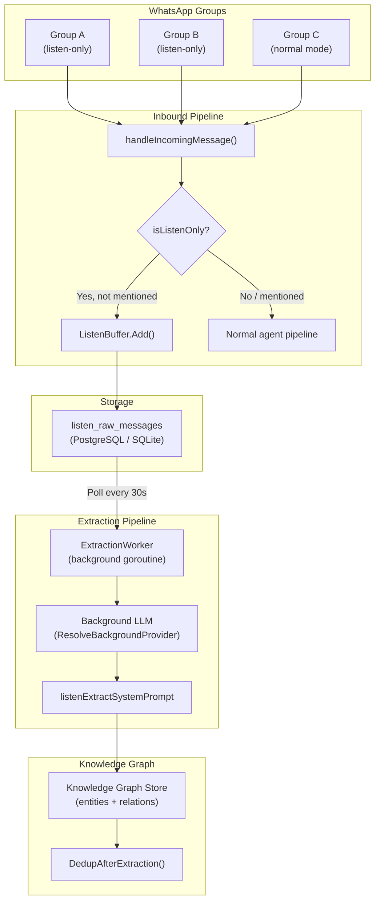
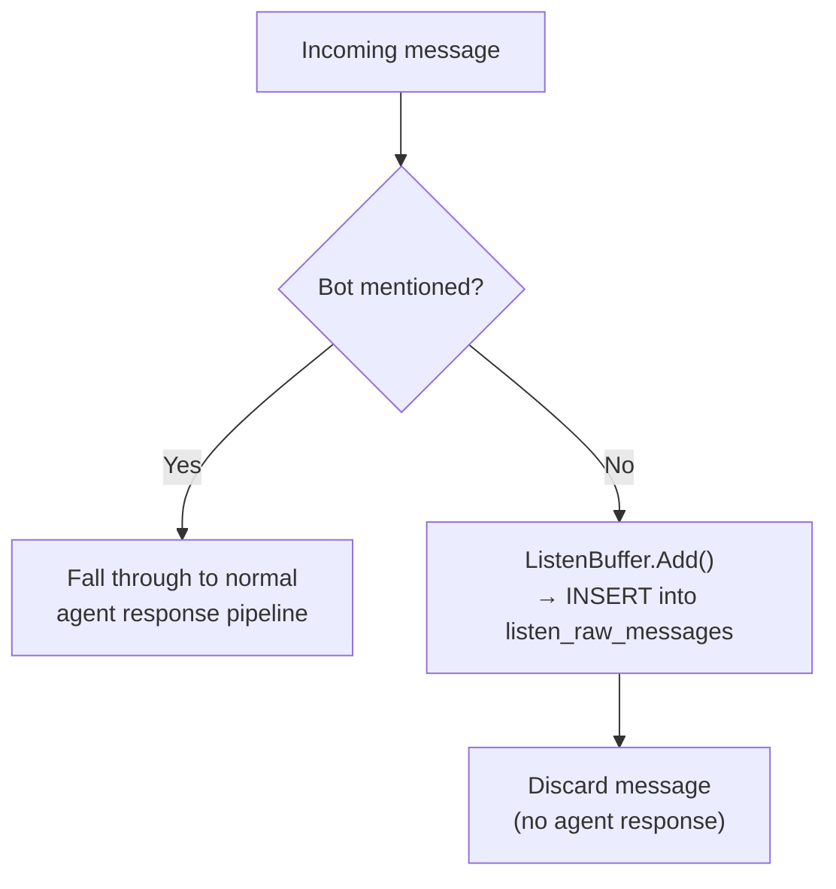
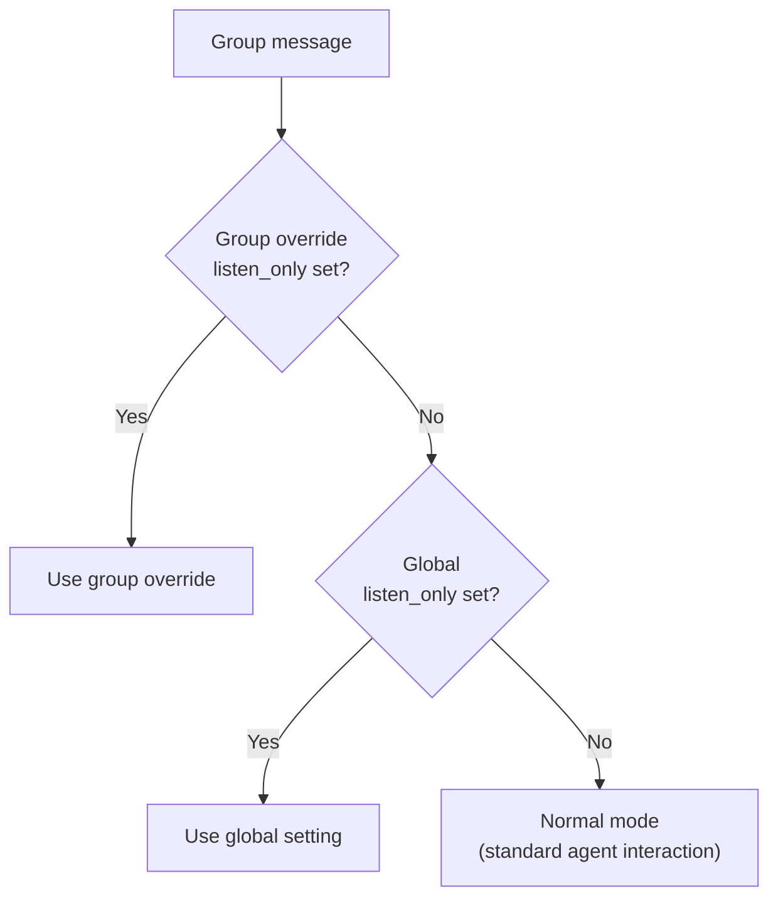
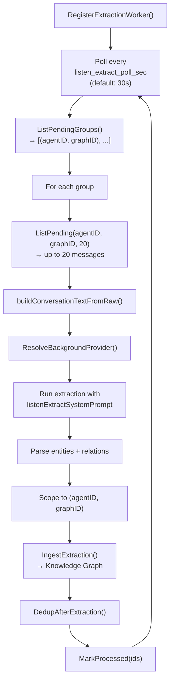
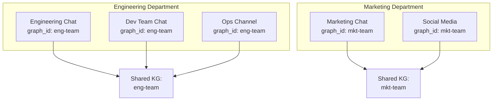
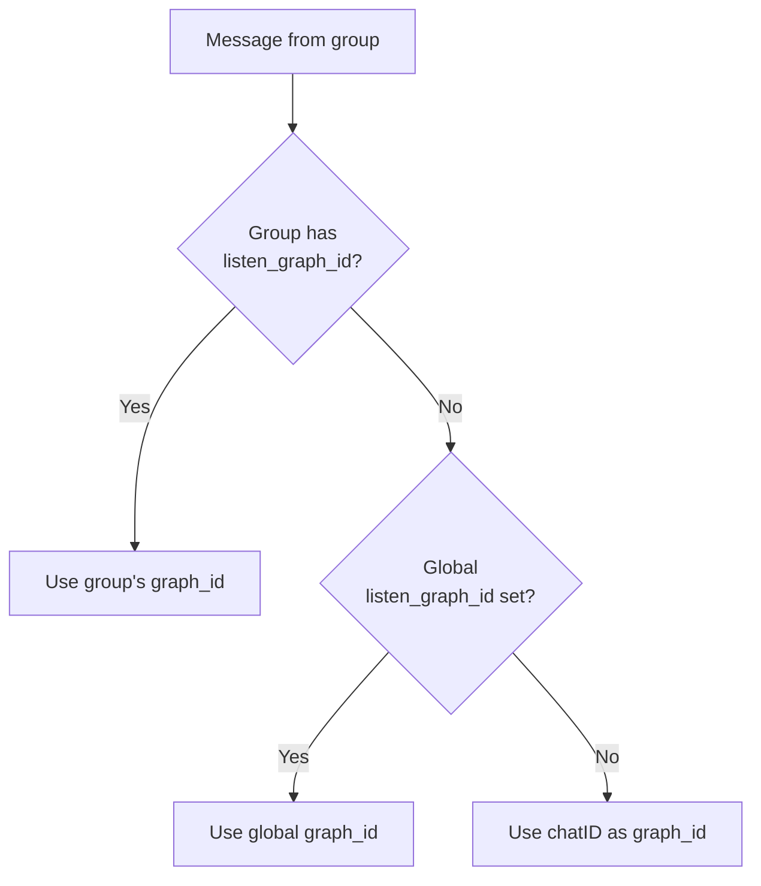
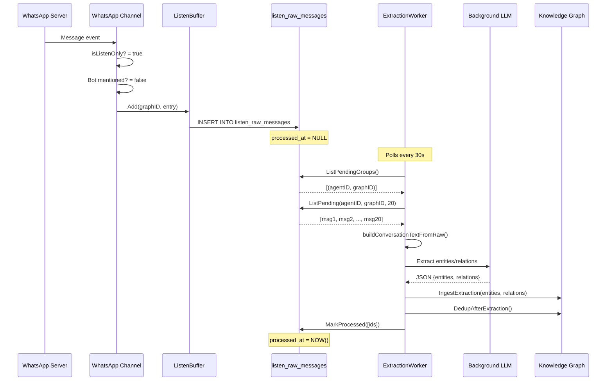
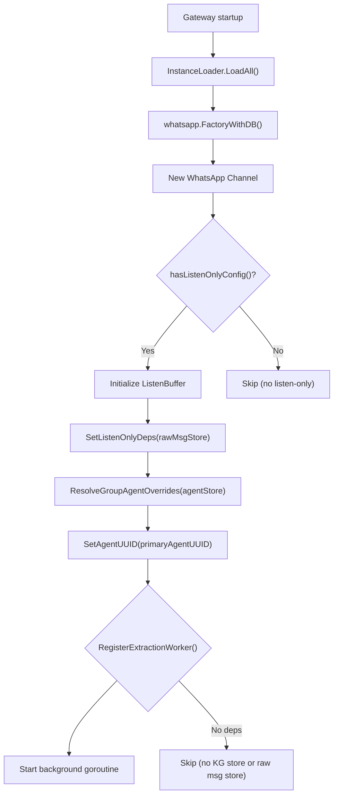

# 25 - WhatsApp Group Intelligence

WhatsApp Group Intelligence enables the bot to silently observe group conversations, extract structured knowledge (entities and relations), and store them in the Knowledge Graph — without actively responding. This turns WhatsApp groups into information sources that agents can query later.

> **Parent document:** [05-channels-messaging.md](./05-channels-messaging.md#9-whatsapp) (Section 9: WhatsApp channel overview)

---

## 1. Architecture Overview



The system has two independent loops:
1. **Inbound loop** (synchronous): Messages arrive via whatsmeow events, listen-only messages are immediately inserted into `listen_raw_messages` table
2. **Extraction loop** (asynchronous): A background goroutine polls the raw message table, batches pending messages, runs LLM extraction, and ingests results into the Knowledge Graph

---

## 2. Listen-Only Mode

### Activation

Listen-only mode can be configured globally or per-group:

| Level | Config Key | Scope |
|-------|-----------|-------|
| Global (DMs) | `listen_only` | All direct messages |
| Per-group | `groups.<chatID>.listen_only` | Specific WhatsApp group |

Per-group override takes precedence for group messages. For DMs, the global setting is used.

### Behavior

When a message arrives in a listen-only context:



- **Bot mentions break listen-only**: If someone @mentions the bot in a listen-only group, the message is routed to the normal agent response pipeline instead. This allows on-demand interaction.
- **Media is not forwarded**: Media files from listen-only messages are cleaned up after insertion. Only the text content (including media captions) is stored.
- **Sender annotation**: Content is prefixed with `[From: senderName]` before storage.
- **No typing indicators**: Listen-only messages do not trigger typing state.

### Effective Mode Resolution



---

## 3. Raw Message Storage

### Schema

Messages are stored in the `listen_raw_messages` table with full metadata:

| Column | Type | Description |
|--------|------|-------------|
| `id` | UUID (v7) | Primary key, time-sortable |
| `channel_name` | text | Always `"whatsapp"` |
| `chat_id` | text | WhatsApp group JID (e.g., `123456789@g.us`) |
| `chat_name` | text | Group name at time of capture |
| `graph_id` | text | KG scope ID for extraction grouping |
| `sender` | text | Display name of sender |
| `sender_id` | text | WhatsApp JID of sender |
| `body` | text | Message content (with sender annotation) |
| `msg_timestamp` | timestamptz | Original WhatsApp message timestamp |
| `agent_id` | UUID | Agent UUID (per-group override or channel default) |
| `tenant_id` | UUID | Tenant scope |
| `created_at` | timestamptz | Insertion time |
| `processed_at` | timestamptz (nullable) | NULL = pending, set when extracted |

### Dual Backend

| Backend | Implementation | Use Case |
|---------|---------------|----------|
| PostgreSQL | `internal/store/pg/listen_raw_messages.go` | Standard edition |
| SQLite | `internal/store/sqlitestore/listen_raw_messages.go` | Desktop/Lite edition |

Both implement the `store.ListenRawMessageStore` interface with identical behavior.

### Store Interface

| Method | Purpose |
|--------|---------|
| `AppendBatch(ctx, msgs)` | Insert multiple messages (used by ListenBuffer) |
| `ListPending(ctx, agentID, graphID, maxRows)` | Get unprocessed messages for extraction |
| `MarkProcessed(ctx, ids)` | Mark messages as extracted |
| `ListPendingGroups(ctx)` | Find all `(agentID, graphID)` pairs with pending work |
| `List(ctx, opts)` | Query with filtering and pagination (UI) |
| `ResetProcessed(ctx, agentID, graphID)` | Reset processed messages for re-extraction |

---

## 4. Knowledge Graph Extraction Pipeline

### Extraction Worker

The extraction worker is a background goroutine registered at gateway startup:



### Batch Processing

| Parameter | Value | Description |
|-----------|-------|-------------|
| `extractBatchSize` | 20 | Max messages per extraction batch |
| `PollSec` | 30 (configurable) | Poll interval via `listen_extract_poll_sec` |
| Provider | `ResolveBackgroundProvider()` | Uses the configured background LLM provider |

Multiple groups with the same `graphID` have their messages processed under the same KG scope, enabling cross-group knowledge sharing.

### Extraction Prompt

The `listenExtractSystemPrompt` instructs the LLM to extract structured knowledge from multi-party WhatsApp conversations:

**Entity types extracted:**

| Type | Description |
|------|-------------|
| `person` | People mentioned in conversations |
| `group` | WhatsApp groups or named teams |
| `organization` | Companies, departments |
| `project` | Named projects or initiatives |
| `product` | Products or services discussed |
| `technology` | Tech tools, frameworks, languages |
| `task` | Actionable tasks or to-dos |
| `event` | Events with `event_time` from message timestamps |
| `document` | Referenced documents or files |
| `concept` | Abstract ideas or topics |
| `location` | Physical or virtual places |

**Relation types extracted:**

`collaborates_with`, `reports_to`, `works_on`, `manages`, `participates_in`, `discusses`, `discussed_in`, `uses`, `belongs_to`, `depends_on`, `scheduled_for`, `located_in`, `part_of`, `related_to`

**Confidence thresholds:**
- 0.9+ = explicit statement (always include)
- 0.7–0.9 = implied (include with lower confidence)
- Below 0.7 = skip (too uncertain)

**Event time extraction:** For `entity_type='event'`, the prompt extracts `event_time` from message timestamps in ISO 8601 format. If no specific time is mentioned, the earliest message timestamp in the batch is used as a fallback.

### Conversation Format

Raw messages are formatted for the LLM as structured text:

```
[Messages from WhatsApp: groupName (chatID)]
[2026-04-20T10:30:00Z] Alice:
Let's schedule the sprint review for Friday
[2026-04-20T10:31:00Z] Bob:
Friday works, let's do 2pm
```

Each batch is grouped by `chatID`, enabling the LLM to understand which messages came from which group.

---

## 5. Graph Scope Sharing

### Concept

Multiple WhatsApp groups can share a single Knowledge Graph scope by setting the same `ListenGraphID`:



### Configuration

```json
{
  "groups": {
    "123456@g.us": {
      "name": "Engineering Chat",
      "listen_only": true,
      "listen_graph_id": "eng-team"
    },
    "789012@g.us": {
      "name": "Dev Team Chat",
      "listen_only": true,
      "listen_graph_id": "eng-team"
    }
  }
}
```

Groups `123456@g.us` and `789012@g.us` will share the same Knowledge Graph scope `eng-team`. All extracted entities and relations from both groups are stored under `(agentID, "eng-team")`.

### Resolution

The graph scope is resolved per message:



When no explicit graph ID is configured, the group's `chatID` (WhatsApp JID) is used as the default scope — each group gets its own isolated KG.

---

## 6. Per-Group Agent Routing

Each group can override the agent that processes its messages (both in normal mode and for KG extraction scoping):

| Config | Effect |
|--------|--------|
| No `agent_id` | Use channel's default agent |
| `agent_id: "hr-bot"` | Route group messages to `hr-bot` agent |
| `agent_id: "eng-bot"` | Route group messages to `eng-bot` agent |

Agent key resolution happens at startup via `ResolveGroupAgentOverrides()`, which maps `agent_key` strings to UUIDs using the `AgentStore`. The resolved UUIDs are stored in `groupAgentUUIDs` and used for:
- Inbound message routing (normal mode)
- Raw message `agent_id` field (listen-only mode)
- KG scoping during extraction

---

## 7. Complete Configuration Reference

### Channel-Level (WhatsAppConfig)

| Field | Type | Default | Description |
|-------|------|---------|-------------|
| `listen_only` | *bool | false | Enable listen-only for DMs |
| `listen_graph_id` | string | "" | Default graph scope ID for DMs |
| `listen_extract_poll_sec` | int | 30 | Extraction worker poll interval (seconds) |
| `listen_flush_sec` | int | 300 | Retained for interface compat (not used) |
| `listen_provider` | string | "" | Deprecated — worker uses `ResolveBackgroundProvider()` |
| `listen_model` | string | "" | Deprecated — resolved via provider system |
| `listen_min_conf` | float64 | 0 | Deprecated — confidence handled by prompt |
| `media_caption_delay_ms` | int | 1000 | Caption merge window in ms (-1 = disabled) |

### Per-Group (WhatsAppGroupConfig)

| Field | Type | Default | Description |
|-------|------|---------|-------------|
| `name` | string | "" | Human-readable group alias |
| `agent_id` | string | "" | Agent key override for this group |
| `enabled` | *bool | true | Enable/disable bot for this group |
| `listen_only` | *bool | false | Enable listen-only for this group |
| `listen_graph_id` | string | "" | Graph scope ID (shared across groups with same value) |
| `require_mention` | *bool | channel default | Override mention requirement for this group |

### Example Configuration

```json5
{
  "channels": {
    "whatsapp": {
      "enabled": true,
      "dm_policy": "pairing",
      "group_policy": "open",
      "media_caption_delay_ms": 1500,
      "groups": {
        "120363xxx@g.us": {
          "name": "Engineering Team",
          "listen_only": true,
          "listen_graph_id": "eng-dept",
          "require_mention": false
        },
        "120364xxx@g.us": {
          "name": "Engineering Projects",
          "listen_only": true,
          "listen_graph_id": "eng-dept"  // Shares KG with Engineering Team
        },
        "120365xxx@g.us": {
          "name": "HR Chat",
          "agent_id": "hr-bot",
          "listen_only": true,
          "listen_graph_id": "hr-dept"
        },
        "120366xxx@g.us": {
          "name": "Support Queue",
          "enabled": false  // Disabled for this group
        }
      }
    }
  }
}
```

---

## 8. Data Flow Summary

### Listen-Only Message Lifecycle



### Message Query Flow (Agent Access)

When an agent queries the Knowledge Graph (via `knowledge_graph` tool), extracted entities from WhatsApp conversations are returned alongside other KG data. The agent does not need to know the source — it queries the unified Knowledge Graph scoped by `(agentID, graphID)`.

---

## 9. Integration Points

| System | Integration | Description |
|--------|------------|-------------|
| Knowledge Graph | `store.KnowledgeGraphStore` | Entity/relation ingestion and dedup |
| Provider System | `providerresolve.ResolveBackgroundProvider()` | Resolves which LLM to use for extraction |
| Agent Store | `store.AgentStore` | Resolves group agent_key overrides to UUIDs |
| System Config | `store.SystemConfigStore` | Background provider configuration |
| Raw Message Store | `store.ListenRawMessageStore` | Dual-backend message persistence |
| Instance Loader | `channels.InstanceLoader` | Wires dependencies, resolves overrides at startup |
| Event Bus | Startup lifecycle | Worker registered during gateway boot |

---

## 10. Gateway Wiring

The extraction worker and listen buffer are wired during gateway startup:



Dependencies are wired in order: ListenBuffer requires `ListenRawMessageStore`, extraction worker requires both `ListenRawMessageStore` and `KnowledgeGraphStore`. If any dependency is missing, the corresponding component is silently skipped.

### Flusher Lifecycle

The group history flusher runs as a background goroutine for pending message DB writes:

- **`Start()`** calls `gh.StartFlusher()` to begin the background DB flush goroutine
- **`Stop()`** calls `gh.StopFlusher()` to flush pending message history to DB before shutdown
- **`SetPendingCompaction(cfg)`** configures LLM-based auto-compaction for pending messages
- **`SetPendingHistoryTenantID(id)`** propagates tenant_id to the pending history for DB operations

All methods are nil-safe — no-op if group history is not initialized.

---

## 11. UI Integration

### Bound Channels Section

The agent detail page shows which channel instances are bound to each agent, including WhatsApp groups with per-group agent overrides. Uses `useChannelInstances()` hook and a two-pass matching algorithm:

1. **UUID match** (`inst.agent_id === agentId`): Agent is the channel's default agent. All WhatsApp groups from `config.groups` are collected and shown as inherited (groups without explicit `agent_id` override inherit the channel default).
2. **Agent key match** (`config.groups[x].agent_id === agentKey`): Agent is assigned to specific groups via per-group override. Only matched groups are shown.

Groups render as indented badges under the parent WhatsApp channel badge with a `Users` icon. Inherited groups show an "(inherited)" label.

### WebSocket Methods

| Method | Description |
|--------|-------------|
| `whatsapp.groups.refresh` | Refreshes group list from WhatsApp (fetches joined groups, upserts contacts) |

The refresh method resolves the WhatsApp channel from the manager with up to 10 retries at 300ms intervals to handle async channel loading.

### Group Discovery

Groups are discovered via `RefreshGroups()` which calls `whatsmeow.GetJoinedGroups()`. Results are upserted as contacts with the group JID as the ID and the group name as the display name. The UI can then show available groups for configuration.

### Stale Contact Cleanup

During `RefreshGroups()`, contacts for groups the bot is no longer a member of are automatically removed via `DeleteStaleGroupContacts()`. After upserting all active groups, the method collects active JIDs and deletes contacts matching the channel type whose `sender_id` is not in the active set. Both PostgreSQL and SQLite implementations are tenant-scoped. If no active JIDs exist (bot left all groups), all group contacts for that channel type are removed.

---

## File Reference

| File | Purpose |
|------|---------|
| `internal/channels/whatsapp/extract_worker.go` | Background KG extraction worker: polls, batches, extracts, ingests |
| `internal/channels/whatsapp/listen_buffer.go` | Immediate INSERT of listen-only messages into raw message store |
| `internal/channels/whatsapp/listen_prompt.go` | LLM system prompt for WhatsApp conversation KG extraction |
| `internal/channels/whatsapp/inbound.go` | Listen-only routing in inbound message pipeline |
| `internal/channels/whatsapp/whatsapp.go` | `hasListenOnlyConfig()`, `isListenOnly()`, `resolveGraphID()`, `SetListenOnlyDeps()` |
| `internal/channels/whatsapp/group_methods.go` | `whatsapp.groups.refresh` WebSocket method |
| `internal/channels/whatsapp/media_caption_buffer.go` | Media caption merge buffer for listen-only and normal mode |
| `internal/store/listen_raw_message_store.go` | Store interface: `ListenRawMessage`, `ListenRawMessageStore` |
| `internal/store/pg/listen_raw_messages.go` | PostgreSQL implementation with tenant scoping |
| `internal/store/sqlitestore/listen_raw_messages.go` | SQLite implementation (desktop edition) |
| `internal/config/config_channels.go` | `WhatsAppConfig.ListenOnly`, `WhatsAppGroupConfig.ListenGraphID` |
| `ui/web/src/pages/agents/agent-detail/config-sections/bound-channels-section.tsx` | UI: bound channel instances display |

---

## Cross-References

| Document | Relevant Content |
|----------|-----------------|
| [05-channels-messaging.md](./05-channels-messaging.md) | WhatsApp channel overview, configuration, media handling |
| [06-store-data-model.md](./06-store-data-model.md) | `listen_raw_messages` table schema, Knowledge Graph store |
| [07-bootstrap-skills-memory.md](./07-bootstrap-skills-memory.md) | Knowledge Graph entity/relation model, 3-tier memory |
| [02-providers.md](./02-providers.md) | Background provider resolution for extraction |
| [09-security.md](./09-security.md) | Tenant isolation in raw message queries |
